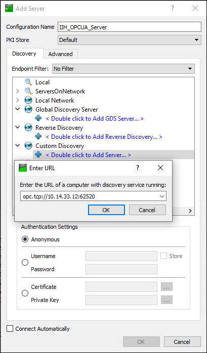

# Industrial Information Hub (IIH) Getting Started

This repository contains the source files to build the Industrial Information Hub Getting Started example.

- [Industrial Information Hub (IIH) Getting Started](#industrial-information-hub-iih-getting-started)
  - [Description](#description)
    - [Overview](#overview)
    - [General Task](#general-task)
  - [Requirements](#requirements)
    - [Prerequisites](#prerequisites)
    - [Used components](#used-components)
    - [TIA Project](#tia-project)
  - [Configuration Steps](#configuration-steps)
  - [Usage](#usage)
  - [Documentation](#documentation)
  - [Contribution](#contribution)
  - [License and Legal Information](#license-and-legal-information)

## Description

### Overview

This application example describes the implementation and usage of the IIH as a central integration layer. It is shown how data can be read from a PLCs and get mapped on a data model. This model then can be accessed by external applications via different APIs or OPC UA.

### General Task
The main goal of the task is to read some relevant data from the PLC and have it accessible to other applications with a standardized model of information using OPC UA Companion Specifications. IIH maps data from PLC to those models and makes data accessible via an OPC UA Server.
To read data from PLC two options are demonstrated: 
1. OPC UA Connector (Databus)
2. SIMATIC S7+ Connector (IIH Connectivity Suite)  
   
In this example it is explained how to get the data from those connectors to the IIH.

## Requirements

### Prerequisites

* Access to an Industrial Edge Management System (IEM)
* Onboarded Industrial Edge Device on IEM
* Installed System Configurators for IE Databus and OPC UA Connector
* Installed System Apps IE Databus and OPC UA Connector
* Installed Apps SIMATIC S7+ Connector
* Installed Apps SIMATIC S7+ Import Converter
* Installed Apps IIH Core
* Installed Apps IIH Configurator
* Installed Apps IIH Registry Service
* Edge device is connected to PLC
* TIA portal project loaded on PLC (e.g. filling application) with OPC UA Server activated
* OPC UA model created with SiOME using a Companion Specification

### Used components

TIA and PLC:
* TIA Portal V16
* PLC: CPU 1511 FW 2.8.3
* SIMATIC SCADA Export V16
* Siemens OPC UA modeling Editor (SiOME) V2.5.12
* UA Expert 1.6.3
  
Industrial Edge:
* Industrial Edge Management App V1.13.10
* IE Databus V2.2.0
* IE Databus Configurator V2.2.0
* OPC UA Connector V1.8.1
* Common Connector Configurator V1.8.2
* SIMATIC S7+ Connector V1.2.0
* SIMATIC S7+ Import Converter V1.2.0
* IIH Core V1.6.1
* IIH Configurator V1.6.1
* IIH Registry Service V1.6.1
* Data Service V1.7.0
* Industrial Edge Virtual Device V1.12.0.3-a

### TIA Project
The application example is based on the filling bottles example:
- [Tank application](https://github.com/industrial-edge/miscellaneous/tree/main/tank%20application)

## Configuration Steps

* [Configure PLCs](docs/Installation.md#configure-plcs-with-tia-portal)
* [Configure PLC Connections](docs/Installation.md#configure-plc-connection)
* [Import OPC UA Model in IIH](docs/Installation.md#import-opc-ua-model)
* [Tags Mapping](docs/Installation.md#mapping-tags)
* [Creating Asset Model](docs/Installation.md#creating-asset-model)

## Usage

Once the application is successfully deployed, data from the filling bottle machine is accessible via OPC UA to external OPC UA clients.

It is possible to check that using the UA Expert tool:

1. Connect to port `62520` of your IED to reach the IIH OPC UA Server  

2. Authenticate with default username `iihcore` and password `iihcore`  

3. Browse the OPC UA Server Model and display data  

## Documentation

You can find further documentation and help in the following links

* [Industrial Edge Hub](https://iehub.eu1.edge.siemens.cloud/#/documentation)
* [Industrial Edge Forum](https://www.siemens.com/industrial-edge-forum)
* [Industrial Edge landing page](https://new.siemens.com/global/en/products/automation/topic-areas/industrial-edge/simatic-edge.html)
* [Industrial Edge GitHub page](https://github.com/industrial-edge)
* [OPC UA Online Reference](https://reference.opcfoundation.org/)
* [UA_NodeSet](https://github.com/OPCFoundation/UA-Nodeset)
* [SiOME](https://support.industry.siemens.com/cs/es/en/view/109755133)

## Contribution

Thank you for your interest in contributing. Anybody is free to report bugs, unclear documentation, and other problems regarding this repository in the Issues section.

Additionally everybody is free to propose any changes to this repository using Pull Requests.

If you are interested in contributing via Pull Request, please check the [Contribution License Agreement](Siemens_CLA_1.1.pdf) and forward a signed copy to [industrialedge.industry@siemens.com](mailto:industrialedge.industry@siemens.com?subject=CLA%20Agreement%20Industrial-Edge).

## License and Legal Information

Please read the [Legal information](LICENSE.txt).

