# Installation
- [Installation](#installation)
  - [Configure PLCs with TIA Portal](#configure-plcs-with-tia-portal)
  - [Configure Databus Settings](#configure-databus-settings)
    - [Configure Common Configurator](#configure-common-configurator)
  - [Configure PLC Connections](#configure-plc-connections)
    - [Option 1: SIMATIC S7+ Connector](#option-1-simatic-s7-connector)
      - [Common Import Converter](#common-import-converter)
    - [Option 2: OPC UA Connector](#option-2-opc-ua-connector)
      - [Common Import Converter](#common-import-converter-1)
      - [Configure OPC UA Connector](#configure-opc-ua-connector)
  - [Import OPC UA Model](#import-opc-ua-model)
    - [Import a Companion Specification](#import-a-companion-specification)
    - [Import the OPC UA model](#import-the-opc-ua-model)
  - [Mapping tags](#mapping-tags)
    - [Option 1: SIMATIC S7+ Connector Mapping](#option-1-simatic-s7-connector-mapping)
    - [Option 2: OPC UA Connector Mapping](#option-2-opc-ua-connector-mapping)
  - [Creating Asset Model](#creating-asset-model)
  
## Configure PLCs with TIA Portal
For this tutorial two PLCs will be used that each demonstrate one line of a production plant. The TIA project can be found [here](https://github.com/industrial-edge/miscellaneous/blob/main/tank%20application/tia-tank-application.zap19). Please adjust the IP adresses to your enviroment, download the project to two PLCs and start them up. A simulation of a filling line will be excecuted automatically.

## Configure Databus Settings
1. Go to the IEM and open the Databus Configurator in the **Data Connections** section.
   
2. Create a new user and assign the topic `ie/#` with permission `Publish and Subscribe`.   
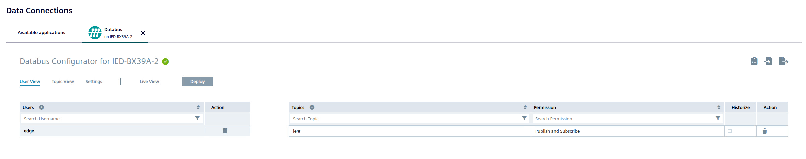

3. **Deploy** the configuration.

### Configure Common Configurator
This apps allows the configuration of the IIH. 

1. In your IED open the Common Configurator.

2. Go to the **Settings** tab and add the Databus credentials for **Data Publisher settings** and **Data Subscriber settings**. Make sure that the default Databus Service name (ie-databus:1883) is also entered.   
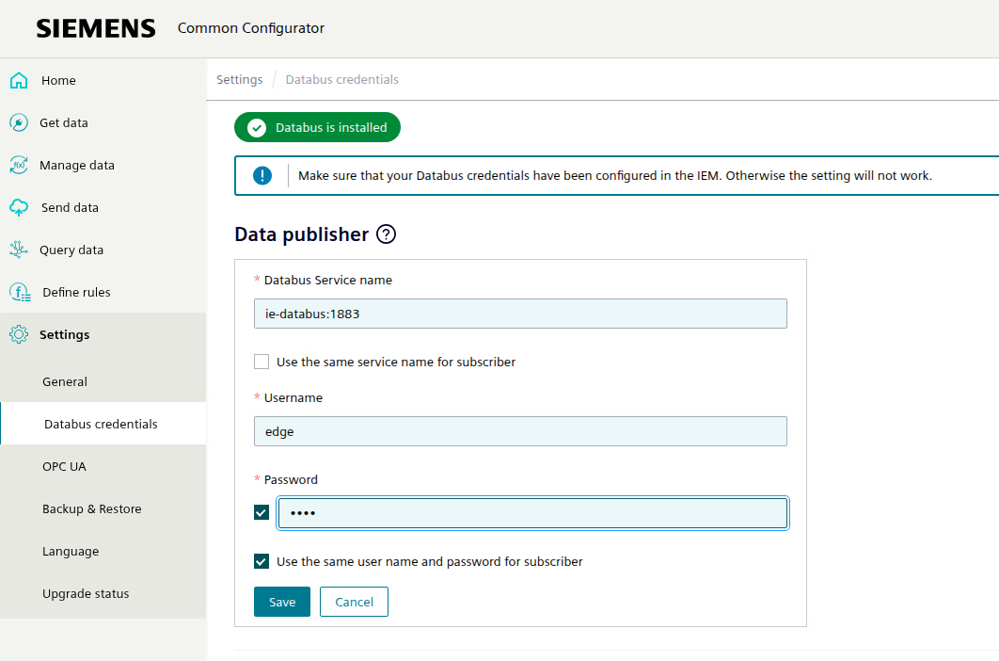

## Configure PLC Connections
To retrieve relevant data from the PLCs to the Edge Device, several connectors are available. The IIH forms a central integration layer where all connector data can be standardized and mapped onto a data model. For this example, we will use the OPC UA Connector and the SIMATIC S7+ Connector.

  
### Option 1: SIMATIC S7+ Connector
The SIMATIC S7+ Connector reads data from the PLC and then the IIH app will collect it. To get the relevant information from the PLC we can export the tags from the TIA Portal project using [SIMATIC SCADA Export for TIA Portal](https://support.industry.siemens.com/cs/ww/en/view/109748955).

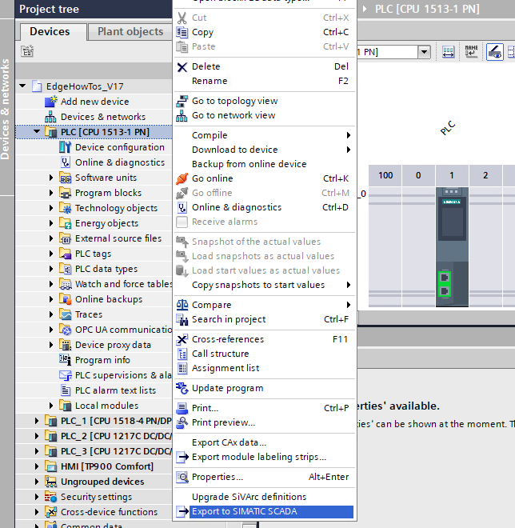

A file [**Export.zip**](../src/Export.zip) is created. This file is available in [src](../src) directory.

In order to build this infrastructure, we need to have installed the following connectors and apps:

- Common Configurator
- Common Import Converter
- IIH Semantics
- SIMATIC S7+ Connector

#### Common Import Converter
The Common Import Converter converts the exported file (Export.zip) into a SIMATIC S7+ Connector configuration.

### Option 2: OPC UA Connector
The OPC UA Connector reads data from the PLCs OPC UA Server and sends data to the Databus where the IIH app will collect it.

In order to build this infrastructure, we need the following connectors and apps:

- Common Configurator
- Common Import Converter
- Databus
- IIH Semantics
- OPC UA Connector

#### Common Import Converter
The Common Import Converter converts the configuration deployed by the OPC UA Connector Configurator into a OPC UA Connector configuration.

#### Configure OPC UA Connector
2. Go to **Get Data -> Connector Configuration** and click inside the **OPC UA Connector** box.  
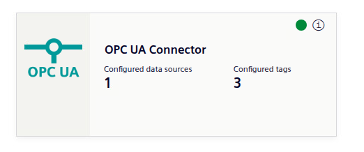  

3. Add a new data source.  
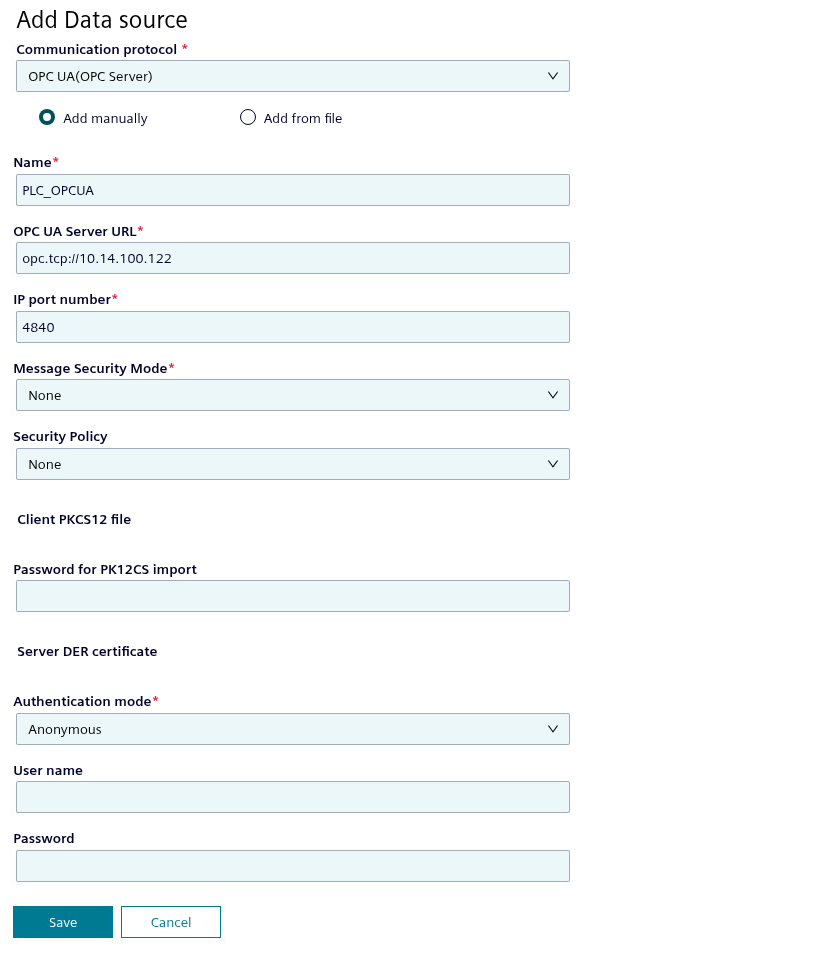

4. Select all the tags needed, choose the Acquisition Cycle, the Access Mode and click on **Save for import** and then **Add to Data Source**.
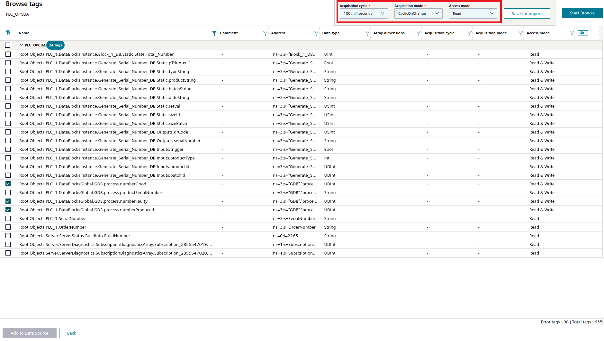

1. **Deploy** the configuration.

If you don't want to perform all these steps manually, you can import this [configuration file](../src/opcuaconnector.json).

## Import OPC UA Model
OPC UA protocol allows companies or organizations to standardize their data in an OPC UA information model. Generating standardized interfaces for OPC UA servers enables interoperability at the semantic level.

Companion specifications are so called "Industry Standard Models". There are many organizations or groups which have standardized some OPC UA information models for some industries, but a user can also create their own companion specifications.

In this example, a user-defined companion specification for the filling bottle machine was created and then used as basis for a data model using the Siemens OPC UA modeling Editor (SiOME). 

Further information about using SiOME can be found on the [SiOME support page](https://support.industry.siemens.com/cs/es/en/view/109755133).

From SiOME, two nodesets were exported, one for the companion specification and another one for the instance model. The files can be found here:

- [TankNodeset.xml](../src/TankNodeset.xml)
- [TankModelNodeset.xml](../src/TankModelNodeset.xml)

### Import a Companion Specification
In your IED open the Common Configurator.

1. In **Manage Data -> OPC UA Server** select **Add/Import**.   
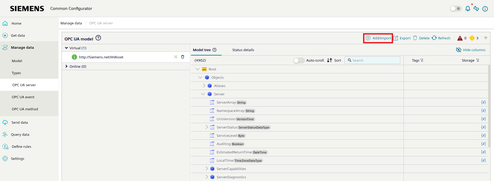

1. Select **Load from file**.   

1. Load the [TankNodeset.xml](../src/TankNodeset.xml) and select the namespace `http://opcfoundation.org/UA/machine/`:   
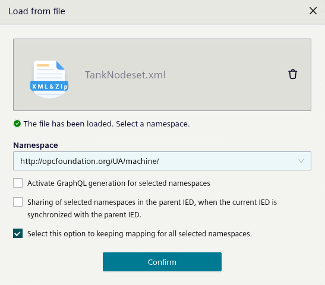

### Import the OPC UA model
The model is an instance of the standardized information that is defined in the companion specification.

1. Select **Add/Import** again.   
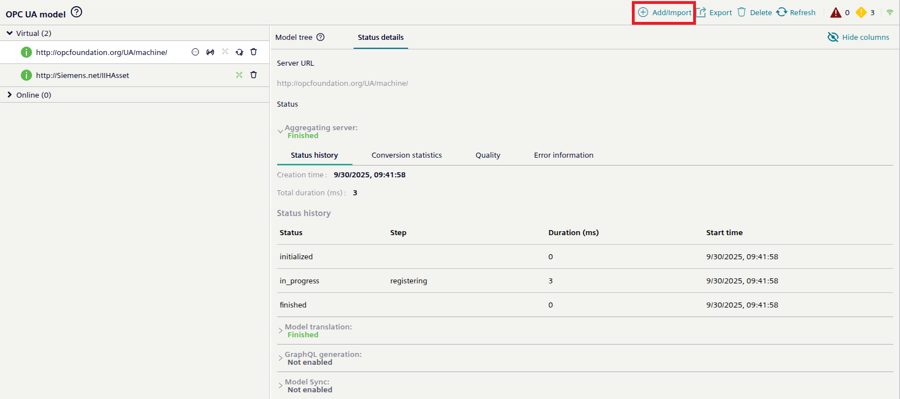

1. Select **Load from file** again.   
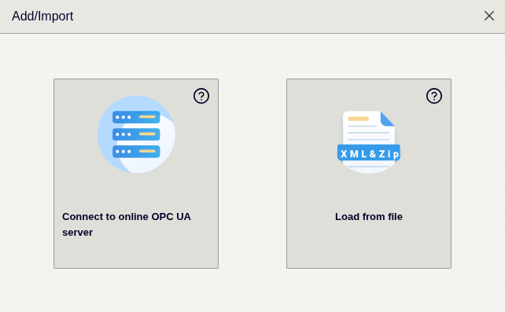

1. Load the [TankModelNodeset.xml](../src/TankModelNodeset.xml) and select the namespace `http://siemens.com/machine/demo`. If you want to use the GraphQL API, please also select the checkbox here.    
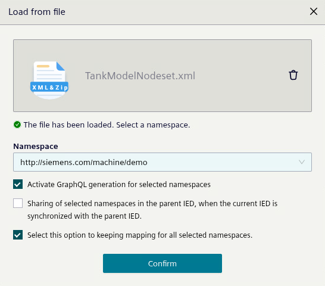

You have successfully created a data model based on OPC UA. The next step is to map connector variables to it in order to fill the model with data.

## Mapping tags
To connect the OPC UA model with the actual values open the Common Configurator on your device and follow the steps below.

### Option 1: SIMATIC S7+ Connector Mapping
1. Go to **Define Data -> Organize**
   
2. Select **OPC UA** and the namespace for the model in the respective dropdown menus on the left side of the window.    
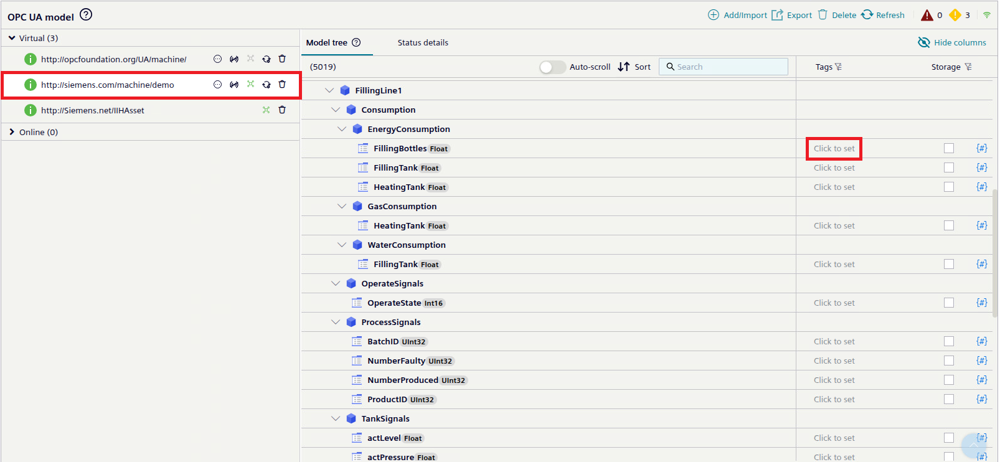

3. Click **Click to set** to open the **Data Sources** Menu. Select **SIMATIC S7+ Connector** from the dropdown menu.   

4. Drag and drop tags from the right window into the OPC UA model.  
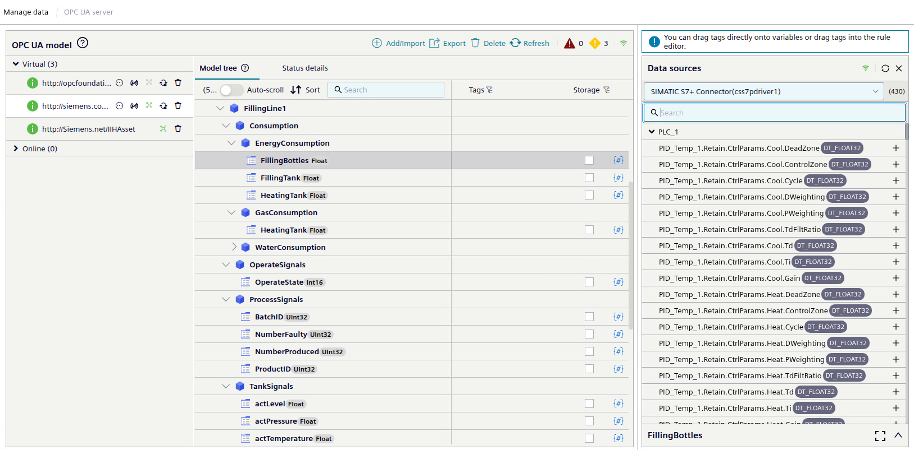

1. **Deploy** the changes.   
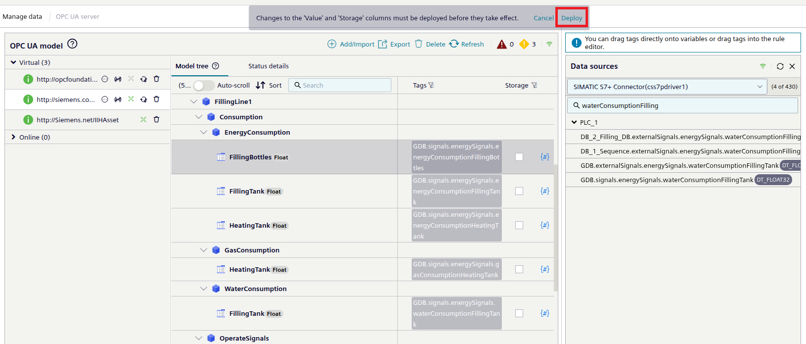

### Option 2: OPC UA Connector Mapping

1. Follow the same procedure for FillingLine2 as for [Option 1](#option-1-simatic-s7-connector-mapping), while selecting 'opcuac1' from the connector dropdown menu:   
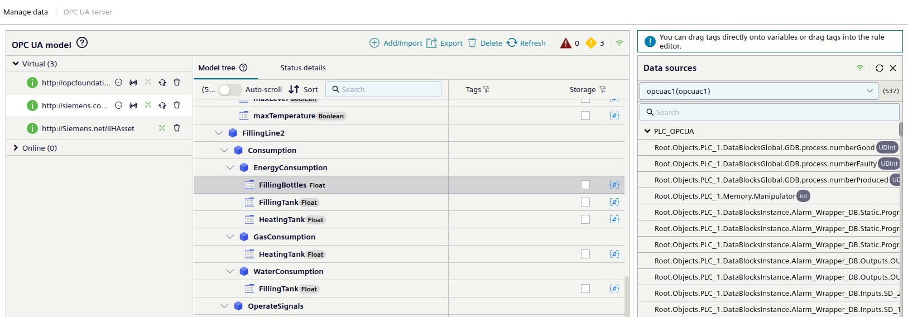

2. **Deploy** the changes.

## Creating Asset Model
To make use of the full functionality of the IIH, use the **Manage Data** Tab > **Model**. This represents the data model structure which is used by several apps like Perfomance Insight or Energy Manager. The OPC UA structure is automatically translated to **Manage Data**. 
  
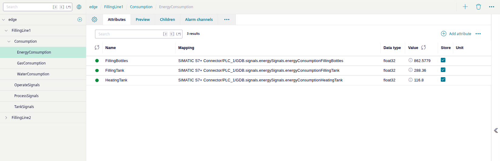

This model will be the central information layer for all your applications. If you have IIH Essentials installed, you are also able to activate the **Storage** and **Cloud Sync** feature for the tags in your asset model (Please be aware, that you need to activate the **Store** Checkbox to see incomming data).