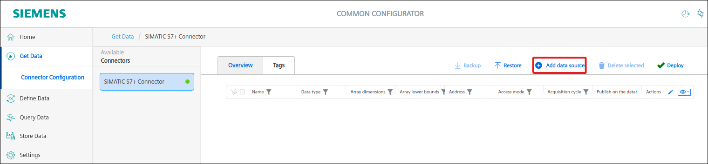
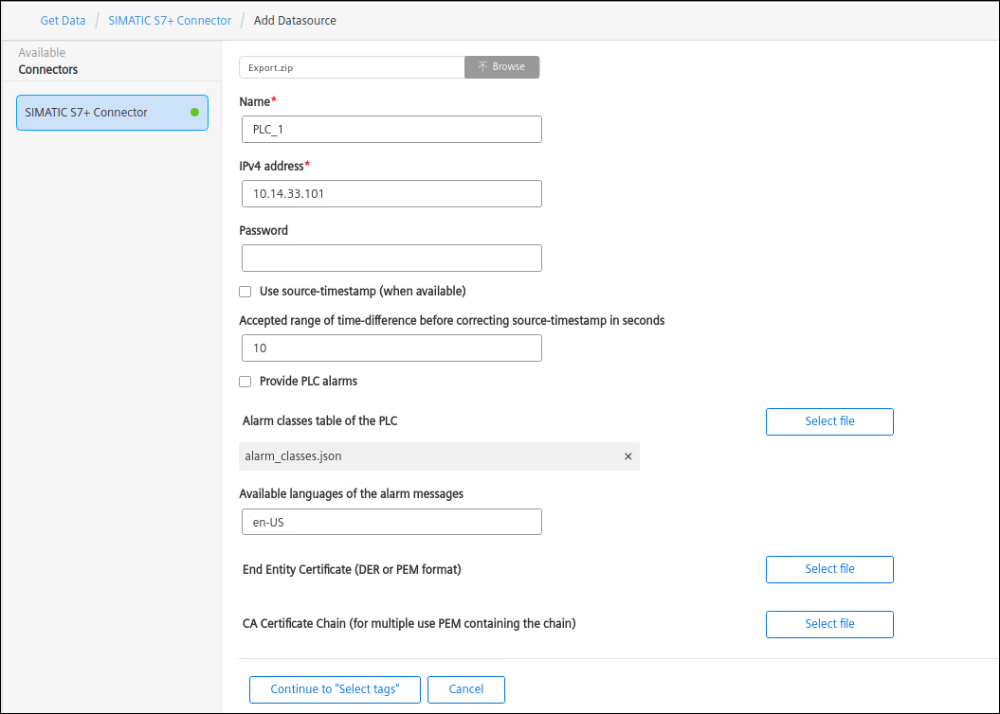
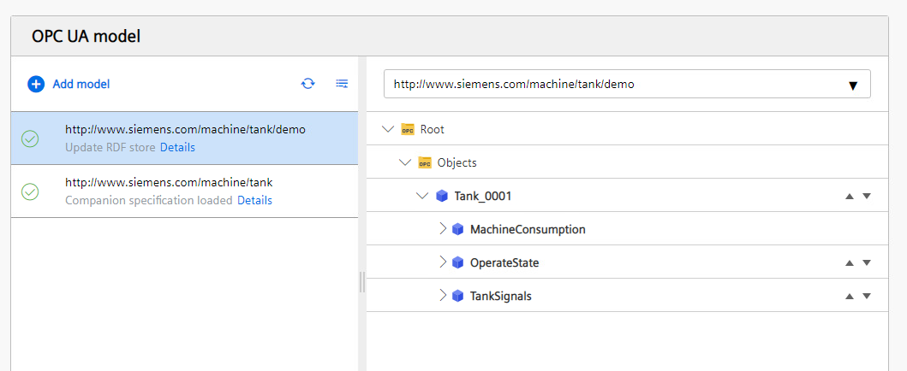

# Installation

- [Installation](#installation)
  - [Configure PLC Connection](#configure-plc-connection)
    - [Option 1: OPC UA Connector](#option1)
    - [Option 2: SIMATIC S7+ Connector](#option2)
  - [Import OPC UA Model](#import-opc-ua-model)
    - [Import a Companion Specification](#import-companion-spec)
    - [Import the OPC UA model](#import_opcua_model)
  - [Mapping tags](#mapping-tags)
    - [Option 1: SIMATIC S7+ Connector Mapping](#mapping-option1)
    - [Option 2: OPC UA Connector Mapping](#mapping-option2)
  
## Configure PLC Connection

To read data from the PLC and provide the data we will use two options, OPC UA Connector and SIMATIC S7+ Connector.

### Option 1: OPC UA Connector

OPC UA Connector reads data from PLC OPC UA Server and sends data to the IE Databus where the IIH app will collect it.

In order to build this infrastructure we need the following connectors and apps:

- IE Databus
- OPC UA Connector
- IIH Registry Service
- IIH Core
- IIH Configurator

#### Configure the IE Databus

In your IEM open the IE Databus and launch the configurator.

Add a user with this topic:   `"ie/#"`   

**Deploy** the configuration.

#### Configure the OPC UA Connector

In your IEM open the OPC UA Connector and launch the configurator.

Add a new data source:

Add needed tags.

Edit the settings. Username and password should be the same as configured in IE Databus configuration.

**Deploy** and **start** the project.

#### IIH Registry Service

This app needs to be installed on the IED and it allows to the IIH to discover which connectors are sending data to the databus.

#### IIH Core

This app collects data from the different connectors.

#### Configure the IIH Configurator

This apps allows the configuration of the IIH.

In your IED click IIH Configurator to open it.

Go to the settings tab and add the Databus credentials for subscribing and publishing topics.

### Option 2: SIMATIC S7+ Connector

SIMATIC S7+ Connector reads data from PLC and then IIH app will collect it. We need to export tags from TIA Portal Project using SIMATIC SCADA Export:

A file **Export.zip** is created.

In order to build this infrastructure we need to have installed the following connectors and apps:

- SIMATIC S7+ Import Converter
- SIMATIC S7+ Connector
- IIH Core
- IIH Configurator

#### Configure IIH Configurator

SIMATIC S7+ Import Converter converts the export file to Connectivity Suite Configuration

In your IED click IIH Configurator to open it.

Go to **Aggregate Data -> Connector Configuration** and to Connectivity Suite Connectors tab and click inside the box.

Add the tags importing the Export.zip file from TIA Portal.

It's necessary to edit the data source and add the **PLC IP address**.

Select all the tags needed, choose the Adquisition Cycle, the Access Mode and the **Apply**.

Import and deploy them.

## Import OPC UA Model

OPC UA protocol allows companies or organizations to standardize their data for an OPC UA information model. It's possible to generate standardized interfaces for the OPC UA servers, so OPC UA clients only need to know the information defined in that standard and not taking into account information not relevant.

This standardized interface is called companion specification. There are already many organizations or groups of companies which have already standardized some OPC UA information models for some industries, but a user can also create their own companion specifications.

In this example there was a user-defined companion specification for the filling bottle machine created and then a model based on this companion specification using Siemens OPC UA modeling Editor (SiOME). 

Further information about using SiOME can be found in the [SIOME](https://support.industry.siemens.com/cs/es/en/view/109755133)

From SiOME two nodesets were exported, one for the companion specification and other one for the instance model. The files you can find here:

- [TankNodeset.xml](../src/TankNodeset.xml)
- [TankModelNodeset.xml](../src/TankNodeset.xml)

### Import a Companion Specification

Go to IIH Configurator.

In Organize Data -> Mapping & Transformation select **Create Model**. Then select **Add Model**.

Add a companion specification .xml file. The file used in the example is called TankNodeset.xml

Load the TankNodeset.xml and select the namespace for the companion specification:

### Import the OPC UA model

The model is an instance of the standardized information that is defined in the companion specification.

Add the model.

Load the TankModelNodeset.xml

Select the namespace for that model.

## Mapping tags

### Option 1: SIMATIC S7+ Connector Mapping

Select **Assigned to OPC UA** and the namespace for the model. 
Select **Connectivity Suite** as a data source and **SIMATIC S7+ Connector** as the connecotr.
Drag and drop tags from the connector into the model window.

**Deploy**

### Option 2: OPC UA Connector Mapping

Select **Assigned to OPC UA** and the namespace for the model. 
Select **Databus** as a data source and **opcua** as the connecotr.
Drag and drop tags from the connector into the model window.

**Deploy**

