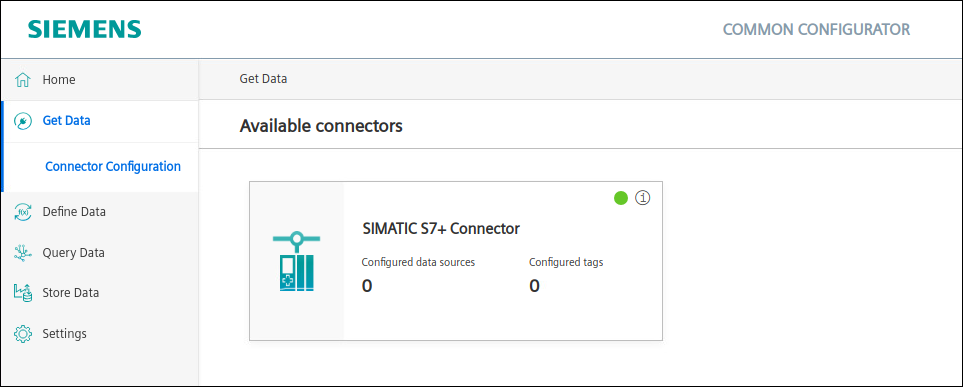
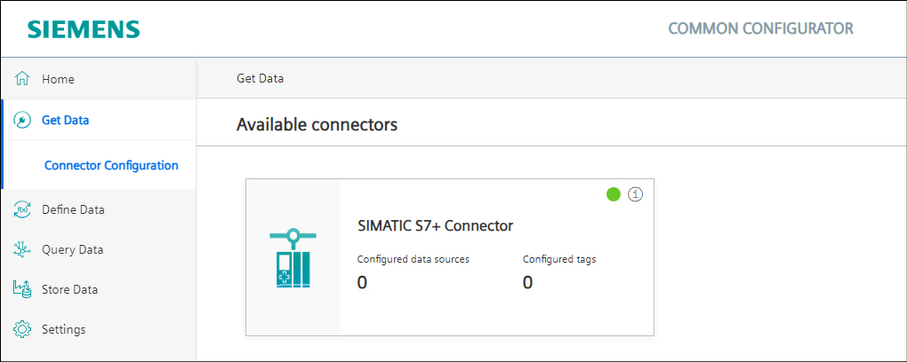
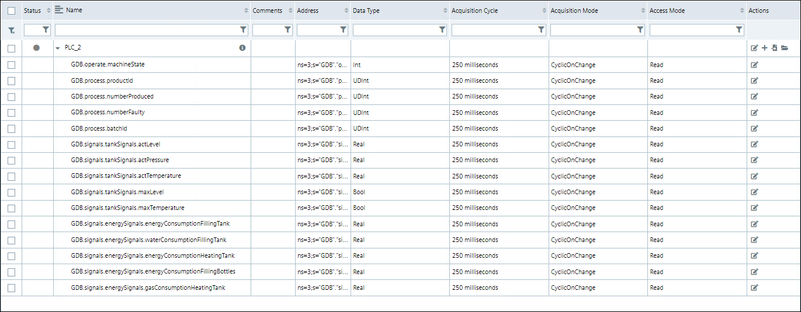
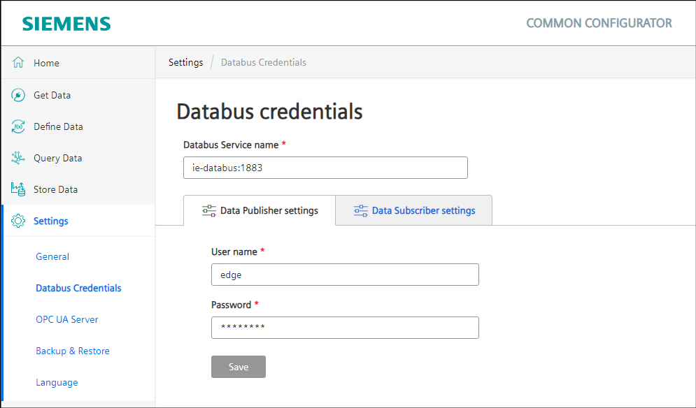
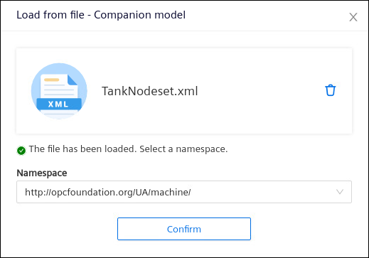
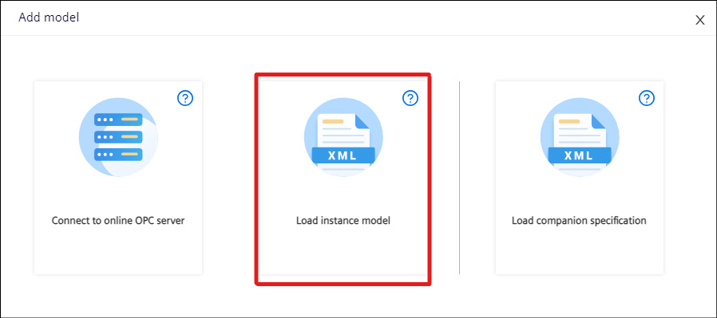
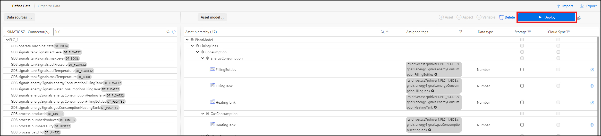
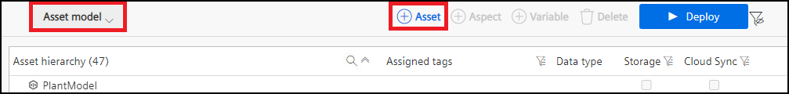
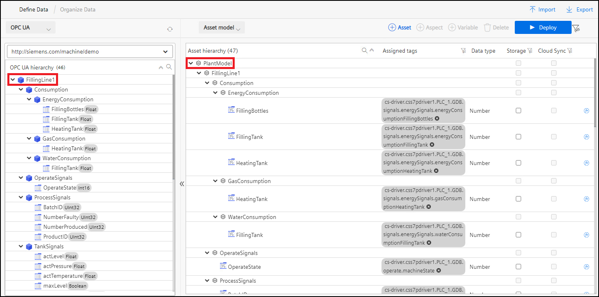

# Installation
- [Installation](#installation)
  - [Configure PLCs with TIA Portal](#configure-plcs-with-tia-portal)
  - [Configure PLC Connections](#configure-plc-connections)
    - [Option 1: SIMATIC S7+ Connector](#option-1-simatic-s7-connector)
      - [Common Import Converter](#common-import-converter)
      - [Registry Service](#registry-service)
      - [Configure Common Configurator](#configure-common-configurator)
    - [Option 2: OPC UA Connector](#option-2-opc-ua-connector)
      . [Common Import Converter](#common-import-converter-1)
      - [Registry Service](#registry-service-1)
      - [Configure Databus](#configure-databus)
      - [Configure OPC UA Connector](#configure-opc-ua-connector)
      - [Common Configurator](#configure-common-configurator-1)
  - [Import OPC UA Model](#import-opc-ua-model)
    - [Import a Companion Specification](#import-a-companion-specification)
    - [Import the OPC UA model](#import-the-opc-ua-model)
  - [Mapping tags](#mapping-tags)
    - [Option 1: SIMATIC S7+ Connector Mapping](#option-1-simatic-s7-connector-mapping)
    - [Option 2: OPC UA Connector Mapping](#option-2-opc-ua-connector-mapping)
  - [Creating Asset Model](#creating-asset-model)
  
## Configure PLCs with TIA Portal
For this tutorial two PLCs will be used that each demonstrate one line of a production plant. The TIA project can be found [here](https://github.com/industrial-edge/miscellaneous/blob/main/tank%20application/tia-tank-application.zap16). Please adjust the IP adresses to your enviroment, download the project to two PLCs and start them up. A simulation of a filling line will be excecuted automatically.

## Configure PLC Connections
To retrieve relevant data from the PLCs to the Edge Device, several connectors are available. The IIH forms a central integration layer where all connector data can be standardized and mapped onto a data model. For this example, we will use two options: the OPC UA Connector and the SIMATIC S7+ Connector.

### Option 1: SIMATIC S7+ Connector
The SIMATIC S7+ Connector reads data from the PLC and then the IIH app will collect it. To get the relevant information from the PLC variables we can export the tags from the TIA Portal project using [SIMATIC SCADA Export for TIA Portal](https://support.industry.siemens.com/cs/ww/en/view/109748955).

A file **Export.zip** is created. This file is available in [src](../src).

In order to build this infrastructure, we need to have installed the following connectors and apps:

- Common Configurator
- Common Import Converter
- IIH Semantics
- Registry Service
- SIMATIC S7+ Connector

#### Common Import Converter
The Common Import Converter converts the exported file (Export.zip) into a SIMATIC S7+ Connector configuration.

#### Registry Service
This app needs to be installed on the IED. It allows service registration and service discovery for connectors and related components.

#### Configure Common Configurator
In your IED click the Common Configurator to open it.

1. Go to **Get Data -> Connector Configuration** and click inside the **SIMATIC S7+ Connector** box. 

2. Go to **Tags** and click on **Add data source**. 

3. Select the communication protocol and the option **Add from file**.

4. After importing the file make sure to set the **PLC IP address** correctly. Then click on **Continue to "Select Tags"**.

5. Per default all tags are preconfigured. You can select all and press **Reset Configuration**.
   
6. Select all the tags needed, choose the Acquisition Cycle, the Access Mode and click **Apply** and then **Import**.  

7. Select the PLC Connection and then deploy.  

8. Monitor the connection status in the **Connector Configuration** tab.

### Option 2: OPC UA Connector
The OPC UA Connector reads data from the PLCs OPC UA Server and sends data to the Databus where the IIH app will collect it.

In order to build this infrastructure, we need the following connectors and apps:

- Common Configurator
- Common Import Converter
- Databus
- IIH Semantics
- OPC UA Connector
- Registry Service

#### Common Import Converter
The Common Import Converter converts the exported file (Export.zip) into a SIMATIC S7+ Connector configuration.

#### Registry Service
This app needs to be installed on the IED. It allows service registration and service discovery for connectors and related components.

#### Configure Databus
1. Go on you IEM and open the Databus Configurator in the **Data Connections** section.
   
2. Create a new user and assign the topic `ie/#`.

3. **Deploy** the configuration.

#### Configure OPC UA Connector
1. In your IEM, go to **Data Connections** and launch the **OPC UA Connector configurator**.

2. Go to the settings menu, where you can fill in the Databus user you just created:   

3. Add a new data source.  

4. After adding the PLC, click on the browse symbol and add the following variables to your configuration:  

1. **Deploy** the configuration.

If you don't want to perform all these steps manually, you can import this [configuration file](../src/opcuaconnector.json).

#### Configure Common Configurator
This apps allows the configuration of the IIH. 

1. In your IED click on the Common Configurator to open it.

2. Go to the settings tab and add the Databus credentials for subscribing and publishing topics. Make sure that the default Databus Service name is also entered.

## Import OPC UA Model
OPC UA protocol allows companies or organizations to standardize their data in an OPC UA information model. Generating standardized interfaces for OPC UA servers enables interoperability at the semantic level.

Companion specifications are so called "Industry Standard Models". There are many organizations or groups which have standardized some OPC UA information models for some industries, but a user can also create their own companion specifications.

In this example, a user-defined companion specification for the filling bottle machine was created and then used as a basis for a data model using the Siemens OPC UA modeling Editor (SiOME). 

Further information about using SiOME can be found on the [SiOME support page](https://support.industry.siemens.com/cs/es/en/view/109755133).

From SiOME, two nodesets were exported, one for the companion specification and another one for the instance model. The files can be found here:

- [TankNodeset.xml](../src/TankNodeset.xml)
- [TankModelNodeset.xml](../src/TankModelNodeset.xml)

### Import a Companion Specification
Open the IIH Semantics application on your IED.

1. In **Define Data -> OPCUA Model** select **Add Model**.

1. Select **Load companion specification**.

1. Load the TankNodeset.xml and select the namespace for the companion specification:  

### Import the OPC UA model
The model is an instance of the standardized information that is defined in the companion specification.

1. Select **Add model** again.  

2. Select **Load instance model**.

3. Select the namespace for that model. If you want to use the GraphQL API, please also select the checkbox here.  

You have successfully created a data model based on OPC UA. The next step is to map connector variables to it in order to fill the model with data.

## Mapping tags
To connect the OPCUA model with the actual values open the IIH Semantics app on your device and follow the steps below.

### Option 1: SIMATIC S7+ Connector Mapping
1. Go to **Define Data -> Organize**
   
2. Select **OPC UA** and the namespace for the model in the respective dropdown menus on the right side of the window.  
   
3. On the left side you should see the **Data Sources**. Select **SIMATIC S7+ Connector** from the dropdown menu.  

4. Drag and drop tags from the left window into the OPC UA model.  

5. **Deploy** the changes.

### Option 2: OPC UA Connector Mapping

1. Follow the same procedure as for [Option 1](#option-1-simatic-s7-connector-mapping), while selecting 'opcuac1' from the connector dropdown menu:  
  

2. **Deploy** the changes.

## Creating Asset Model
To make use of the full functionality of the IIH, your OPC UA model has to be mapped to an **Asset Model**. This is the data model structure which is used by several apps like Perfomance Insight or Energy Manager. Open the IIH Semantics app on your device.

1. Go to **Define Data -> Organize**.

2. Select **Asset Model** in the right editor window and create a new asset.

3. Map the OPC UA model by dragging and dropping the OPC UA hierarchy object to the created asset.

This model will be the central information layer for all your applications. If you have IIH Essentials installed, you are also able to activate the **Storage** and **Cloud Sync** feature for the tags in your asset model.