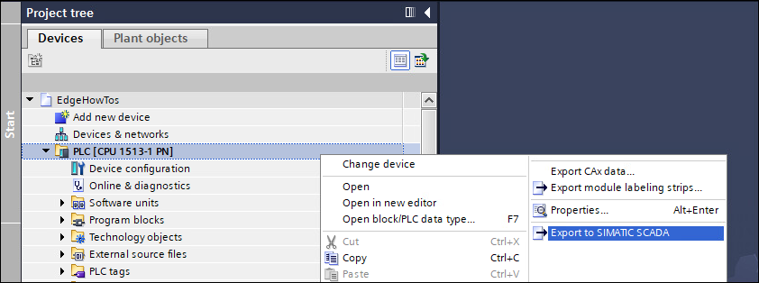
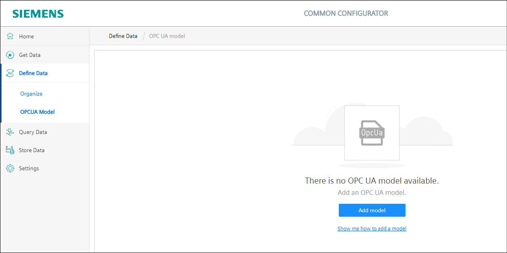
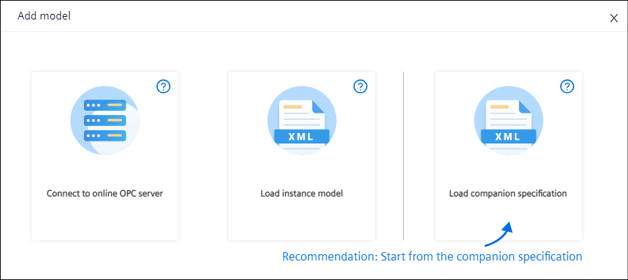
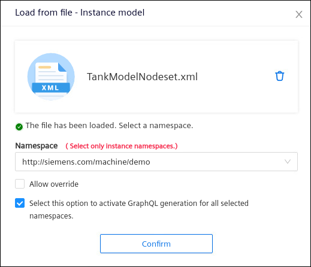

# Installation

- [Installation](#installation)
  - [Configure PLCs with TIA Portal](#configure-plcs-with-tia-portal)
  - [Configure PLC Connection](#configure-plc-connection)
    - [Option 1: SIMATIC S7+ Connector](#option-1-simatic-s7-connector)
      - [Configure IIH Configurator](#configure-iih-configurator)
    - [Option 2: OPC UA Connector](#option-2-opc-ua-connector)
      - [Configure the IE Databus](#configure-the-ie-databus)
      - [Configure the OPC UA Connector](#configure-the-opc-ua-connector)
      - [IIH Registry Service](#iih-registry-service)
      - [Configure the IIH Configurator](#configure-the-iih-configurator)
  - [Import OPC UA Model](#import-opc-ua-model)
    - [Import a Companion Specification](#import-a-companion-specification)
    - [Import the OPC UA model](#import-the-opc-ua-model)
  - [Mapping tags](#mapping-tags)
    - [Option 1: SIMATIC S7+ Connector Mapping](#option-1-simatic-s7-connector-mapping)
    - [Option 2: OPC UA Connector Mapping](#option-2-opc-ua-connector-mapping)
  
## Configure PLCs with TIA Portal

For this tutorial 3 PLCs will be used that each demonstrate one line of a production plant. The TIA project can be found [here]([src/tiaproject.zap16](https://github.com/industrial-edge/miscellaneous/blob/main/tank%20application/tia-tank-application.zap16)). Please adjust the IP adresses to your enviroment, download the project to three PLCs and start them up. A simulation of a filling line will be excecuted automatically.

## Configure PLC Connection

To get the relevant data from the PLCs to the Edge Device there are several Connectors available. The IIH forms a central integration layer where all connector data can be standardized and mapped on a data model. For this example we will use two options, OPC UA Connector and SIMATIC S7+ Connector.

### Option 1: SIMATIC S7+ Connector

SIMATIC S7+ Connector reads data from PLC and then IIH app will collect it. We need to export tags from TIA Portal Project using SIMATIC SCADA Export.

A file **Export.zip** is created. This file is available in [src](../src).

In order to build this infrastructure, we need to have installed the following connectors and apps:

- SIMATIC S7+ Import Converter
- SIMATIC S7+ Connector
- IIH Core
- IIH Configurator

#### Configure IIH Configurator

SIMATIC S7+ Import Converter converts the export file to a Connectivity Suite Configuration.

In your IED click IIH Configurator to open it.

1. Go to **Get Data -> Connector Configuration** and click inside the **SIMATIC S7+ Connector** box.  

2. Add the tags by importing the Export.zip file from TIA Portal.  

3. After importing the file make sure to set the **PLC IP address** correctly.  

4. Select all the tags needed, choose the Acquisition Cycle, the Access Mode and click **Apply** and then **Import**.  

5. Select the PLC Connection and then deploy.  

6. Monitor the connection status in the **Connector Configuration** tab 

### Option 2: OPC UA Connector

OPC UA Connector reads data from PLC OPC UA Server and sends data to the IE Databus where the IIH app will collect it.

In order to build this infrastructure, we need the following connectors and apps:

- IE Databus
- OPC UA Connector
- IIH Registry Service
- IIH Core
- IIH Configurator

#### Configure the IE Databus

1. Go on you IEM and open the Databus Configurator in the **Data Connections** section
   
2. Create a new user and assign the topic `ie/#`  

3. **Deploy** the configuration.

#### Configure the OPC UA Connector

1. In your IEM, go to **Data Connections** and launch the **OPC UA Connector configurator**.

2. Go to the settings menu, where you can fill in the Databus user you just created:   
   

3. Add a new data source.  

4. After adding the PLC, click on the browse symbol and add the following variables to your configuration:  

5. Repeat step 3. and 4. for another PLC (Example Data Model consists of 3 PLCs in total)

6. **Deploy** and **start** the project.

If you don't want to perform all these steps manually, you can import this [configuration file](../src/opcuaconnector.json).

#### IIH Registry Service

This app needs to be installed on the IED. It allows to the IIH to discover which connectors are sending data to the Databus.

#### Configure the IIH Configurator

This apps allows the configuration of the IIH. 

1. In your IED click IIH Configurator to open it.

2. Go to the settings tab and add the Databus credentials for subscribing and publishing topics.  

## Import OPC UA Model

OPC UA protocol allows companies or organizations to standardize their data for an OPC UA information model. It is possible to generate standardized interfaces for the OPC UA servers, so OPC UA clients only need to know the information defined in that standard and not taking into account information not relevant.

This standardized interface is called companion specification. There are already many organizations or groups of companies which have standardized some OPC UA information models for some industries, but a user can also create their own companion specifications.

In this example, a user-defined companion specification for the filling bottle machine was created and then used as a basis for a data model using Siemens OPC UA modeling Editor (SiOME). 

Further information about using SiOME can be found on the [SiOME support page](https://support.industry.siemens.com/cs/es/en/view/109755133)

From SiOME, two nodesets were exported, one for the companion specification and another one for the instance model. The files can be found here:

- [TankNodeset.xml](../src/TankNodeset.xml)
- [TankModelNodeset.xml](../src/TankModelNodeset.xml)

### Import a Companion Specification

Go to IIH Configurator.

In **Organize Data -> Mapping & Transformation** select **Create Model**. Then select **Add Model**.

Add a companion specification .xml file. The file used in the example is called TankNodeset.xml

Load the TankNodeset.xml and select the namespace for the companion specification:

### Import the OPC UA model

The model is an instance of the standardized information that is defined in the companion specification.

Add the model.

Load the TankModelNodeset.xml

Select the namespace for that model.

## Mapping tags

### Option 1: SIMATIC S7+ Connector Mapping

Select **Assigned to OPC UA** and the namespace for the model in the respective dropdown menus. 
Select **Connectivity Suite** as a data source and **SIMATIC S7+ Connector** as the connector.
Drag and drop tags from the **Tags**-window into the OPC UA model.

**Deploy**

### Option 2: OPC UA Connector Mapping

Select **Assigned to OPC UA** and the namespace for the model in the respective dropdown menus.  
Select **Databus** as data source and **opcua** as the connector.
Drag and drop tags from the **Tags**-window into the OPC UA model.

**Deploy**

